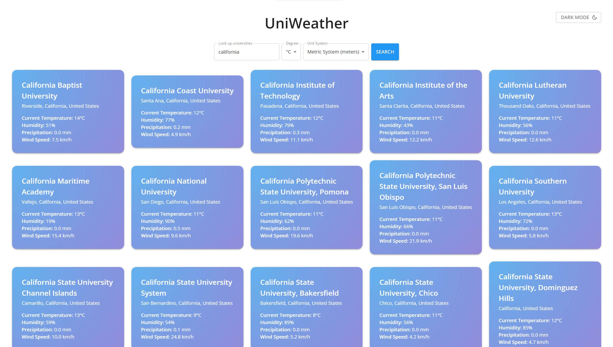
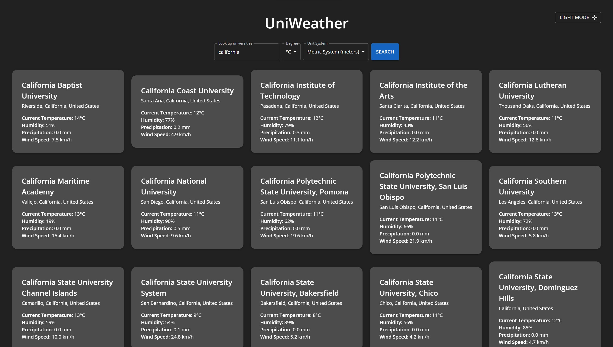

# UniWeather - Personal Project

## Table of contents

- [Overview](#overview)
  - [Introduction](#introduction)
  - [Screenshot](#screenshot)
  - [Features](#features)
  - [Links](#links)
- [My process](#my-process)
  - [Challenges](#challenges)
  - [Highlights](#highlights)
  - [Future plans](#future-plans)
  - [Built with](#built-with)
- [Author](#author)

## Introduction
This is a website that looks up universities around the world and displays their weather data.

### Screenshot

#### Light mode:

#### Dark mode:

### Links

- Live Site URL: [UniWeather](https://uniweather-baodang.vercel.app/)

## My process

- I started by working on API fetching. I did this part as homework for one of my classes.
- There are three APIs in total: Universities API (For looking up universities), Geocoding API (For getting the coordinates of those universities), Weather API (For getting the weather data of those coordinates).
- After having the fetching part done, I began working on the website itself.
- Having used CSS, SCSS, and Sass, this time I would like to try some new tools to design my website, which is when I came across Material UI (MUI).
- There are a lot going on with MUI, so I pretty much learned as I went on. 
- I started with making the form, which was surprisingly simple since I can add them as normal components. The form is already styled like a Google form which is also very nice 👍
- Then I began creating a button for toggle light/dark mode using `useState` and styled the Theme components from MUI. I also used `useMemo` to prevent reloading theme between states.
- The rest is to design the layout for the tile that displays weather data for each university, which was the most challenging part because I kept wanting to add more features and the website became laggy.
- After finishing, I added tab navigation and aria labels to make the website more accessible to visually impaired people.

### Challenges

- The first challenge I encountered was the timing between fetches. With queries that result in a large number of results such as "University", the website will send a large number of fetching requests at once which overloads the API server and leads to the website being IP banned. Also, sometimes the fetching requests didn't go through the first time so I had to fetch a few more times for it to work. To deal with these two problems, I put a delay of 250ms between fetches and wrote a function that detects error and retry to fetch for 3 times with a 500ms delay in between.

- The second problem was that the Universities API is hosted on a HTTP server and my website is hosted on HTTPS server so there was a mixed content error. I struggled with this for a while since I couldn't find any other API that works as well as this API. Fortunately, I found the GitHub for the Universities API and there was a JSON file that contains all the universities data, so instead of fetching from the API, I switched to fetching that JSON file only. Another problem came up was that I needed to work on a search engine for the universities. After looking up a bit, I learned about Trie, which is an efficient string search algorithm by using a tree of prefixes. Luckily there was a npm library for Trie so I didn't have to implement it by myself, and it went smoothly since then.

- Yet, 50% of the time I spent on this website was on styling, especially the gradient and flipping animation. The styling format for MUI using `sx` made my code a bit too long so I had to use a separate theme file that styles all the components, which then led to all kinds of problems: `Box` components cannot be styled with theme, The forms uses `Paper` components so I had to create separate classes to style my `Paper` components, etc. The flipping animation requires the container's height having to be set beforehand, which was quite a problem because the name of the universities can be short or long which affects the height, and the back side doesn't contain long names so its height is usually different from the front side. ALso, the gradient animation requires a big gradient background panel that places behind (`z-index: -1`) the container with `overflow: hidden`. However, setting `overflow: hidden` would also mean not displaying either sides of the cards since both sides are `position: absolute`. I worked with all kinds of methods, such as setting the height of the container to follow the height of each sides for every renders using `useEffect` with `useState` and `useRef`, which worked but not so well with large number of cards as the website gets laggy, or setting the front side to `position: relative` so that the container would automatically be set to its height, which also quite worked but I still wanted to set the container to the back side's height when flipped as well.

- The final solution I had was instead of having the container with the gradient background, I set it to transparent and have each sides of the card handle the gradient background instead. I have both sides as `position: absolute` and set the container to the front side's height only for the first render. Thus, the website doesn't have to re-render whenever a card is flipped, and since the container is transparent, the two sides can be shown with their own heights.

### Future plans

- There is still one problem which is that whenever I go on the website with my phone (light mode), the gradient animation glitches a bit but it doesn't glitch when I try it on desktop with mobile layout and throttling. I am still working on how to fix this. (Fixed by using background-position method instead of background::before method)

- Another problem is that the transition between light mode and dark mode gets slower the more universities there is. I figured it might have been the states of the university cards are interrupting the light/dark mode states, so I tried React's new hook `useTransition` on the cards states to lower their priorities which might help the light/dark mode states be set more quickly. However, the light/dark mode transition is still slow. I wonder if I was using the hook incorrectly. I am still thinking of other ways.

### Highlights
- One thing I did that I don't know why I did is that I personally wrote the weather description for every weather state. Here are a few examples:
  - "It is clear outside. You might want to take a walk!"
  - "It is cloudy right now, but I hope you will always be sunny within yourself."
  - "It is quite windy and dusty outside. Perhaps you should wear sunglasses to protect your pretty eyes."

- I am also glad that I went through with the flipping animation. I decided to finish with only the gradient animation but when I thought about the flipping animation, I planned to give up on it at some point since it was a lot harder than I thought, but I still kept going on with it in the end and it allowed me to learn how to come up with creative solutions during tough times. I am grateful for that.

- I also learned a bit of basic UI concepts such as padding should be in multiple of 4s and I should pay attention on the readability and grouping of elements using smaller padding.

### Built with

- [React](https://reactjs.org/) - JS library
- [NextJS](https://nextjs.org/) - React Framework
- [Material UI](https://mui.com/) - React UI Tools
- Flexbox and Grid

## Author

- GitHub - [Bao Dang](https://github.com/weebao)
